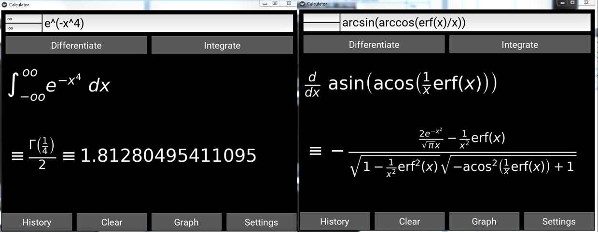

This is an antiderivative calculator with a latex interface that I developed in 2016. The GUI was created using the kivy language,
the rest was coded in python. This tool requires texlive to be installed to work

